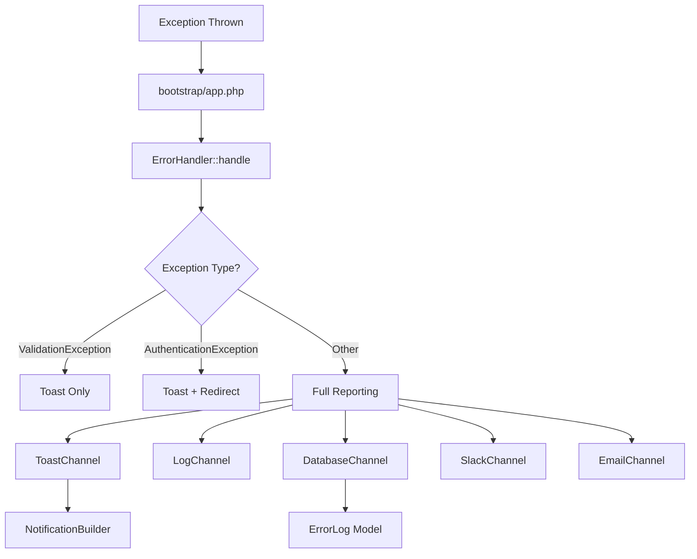

# Error Handling System

The application includes a comprehensive, centralized error handling system that provides:

- **Environment-aware notifications**: Full stack traces in development, user-friendly messages with reference IDs in production
- **Multiple notification channels**: Toast, Slack, Email, Log, and Database
- **Unique reference IDs**: Each error gets a unique ID (e.g., `ERR-20260108-ABC123`) for support communication
- **Database storage**: All errors are logged for future ticketing system integration
- **Sensitive data protection**: Passwords, tokens, and API keys are automatically redacted
- **Sticky error toasts**: Error notifications stay visible until dismissed by user
- **Exception-aware styling**: Authorization errors show as warnings (yellow), other errors as errors (red)

## Quick Start

### Enable/Disable System

The error handling system is **enabled by default in production** and disabled in development.

```env
# Force enable in development
ERROR_HANDLING_ENABLED=true

# Force disable in production (use Laravel default)
ERROR_HANDLING_ENABLED=false
```

### Configuration

All settings are in `config/error-handling.php`. Key environment variables:

```env
# Enable/disable channels
ERROR_HANDLING_SLACK_ENABLED=false
ERROR_HANDLING_EMAIL_ENABLED=false
ERROR_HANDLING_DATABASE_ENABLED=true
ERROR_HANDLING_LOG_ENABLED=true

# Slack webhook (if enabled)
ERROR_HANDLING_SLACK_WEBHOOK_URL=https://hooks.slack.com/services/xxx

# Email recipients (comma-separated)
ERROR_HANDLING_EMAIL_RECIPIENTS=admin@example.com,dev@example.com

# Rate limiting (prevent notification spam)
ERROR_HANDLING_RATE_LIMIT=true
ERROR_HANDLING_MAX_PER_MINUTE=10

# Database retention
ERROR_HANDLING_RETENTION_DAYS=30
```

## Architecture

### Exception Flow



### Notification Channels

| Channel | Purpose | Rate Limited |
|---------|---------|--------------|
| `toast` | User feedback via NotificationBuilder | No |
| `log` | File-based logging | No |
| `database` | Storage for ticketing | No |
| `slack` | Team alerts | Yes |
| `email` | Admin notifications | Yes |

## Usage

### Checking Error Logs

```php
use App\Models\ErrorLog;

// Get recent unresolved errors
$errors = ErrorLog::unresolved()->recent(7)->get();

// Find error by reference ID
$error = ErrorLog::where('reference_id', 'ERR-20260108-ABC123')->first();

// Mark as resolved
$error->resolve(['notes' => 'Fixed in PR #123']);
```

### Pruning Old Logs

```bash
# Prune errors older than 30 days (default)
php artisan errors:prune

# Prune errors older than 7 days
php artisan errors:prune --days=7

# Only prune resolved errors
php artisan errors:prune --resolved

# Dry run (see what would be deleted)
php artisan errors:prune --dry-run
```

### Scheduling Cleanup

Add to `routes/console.php`:

```php
Schedule::command('errors:prune')->daily();
```

## Exception Handling by Type

| Exception | Toast Type | Log | DB | Slack/Email | Response |
|-----------|------------|-----|-----|-------------|----------|
| `ValidationException` | Error | ❌ | ❌ | ❌ | Laravel default |
| `AuthenticationException` | Error | ❌ | ❌ | ❌ | Redirect to login |
| `AuthorizationException` | ⚠️ Warning | ✅ | ✅ | ✅ | 403 |
| `ModelNotFoundException` | Error | ✅ | ✅ | ✅ | 404 |
| `HttpException` | Error | ✅ | ✅ | ✅ | Status code |
| `Throwable` (catch-all) | Error | ✅ | ✅ | ✅ | 500 |

## Reference ID Format

Format: `PREFIX-YYYYMMDD-XXXXXX`

- **PREFIX**: Configurable via `ERROR_REFERENCE_PREFIX` (default: `ERR`)
- **YYYYMMDD**: Date in ISO format
- **XXXXXX**: 6 random alphanumeric characters

Example: `ERR-20260108-A7K2P9`

## Files

| File | Purpose |
|------|---------|
| [config/error-handling.php](file:///Users/hop/Packages/laravel-basic-setup/config/error-handling.php) | Configuration |
| [ErrorHandler.php](file:///Users/hop/Packages/laravel-basic-setup/app/Services/ErrorHandling/ErrorHandler.php) | Main service |
| [ErrorLog.php](file:///Users/hop/Packages/laravel-basic-setup/app/Models/ErrorLog.php) | Database model |
| [Channels/](file:///Users/hop/Packages/laravel-basic-setup/app/Services/ErrorHandling/Channels) | Notification channels |
| [ErrorChannels.php](file:///Users/hop/Packages/laravel-basic-setup/app/Constants/ErrorHandling/ErrorChannels.php) | Channel constants |
| [PruneErrorLogsCommand.php](file:///Users/hop/Packages/laravel-basic-setup/app/Console/Commands/PruneErrorLogsCommand.php) | Cleanup command |
| [lang/en_US/errors.php](file:///Users/hop/Packages/laravel-basic-setup/lang/en_US/errors.php) | Translations |

## Testing

```bash
# Run all error handling tests
php artisan test --filter=ErrorHandler

# Run with verbose output
php artisan test --filter=ErrorHandler -v
```

## Best Practices

1. **Never expose stack traces in production** - The system automatically shows user-friendly messages
2. **Include reference IDs in support requests** - Users should provide the error reference when contacting support
3. **Monitor Slack/Email channels** - Enable in production for immediate awareness
4. **Prune regularly** - Schedule the prune command to prevent database bloat
5. **Check rate limiting** - Adjust `ERROR_HANDLING_MAX_PER_MINUTE` if you get too many/few notifications
