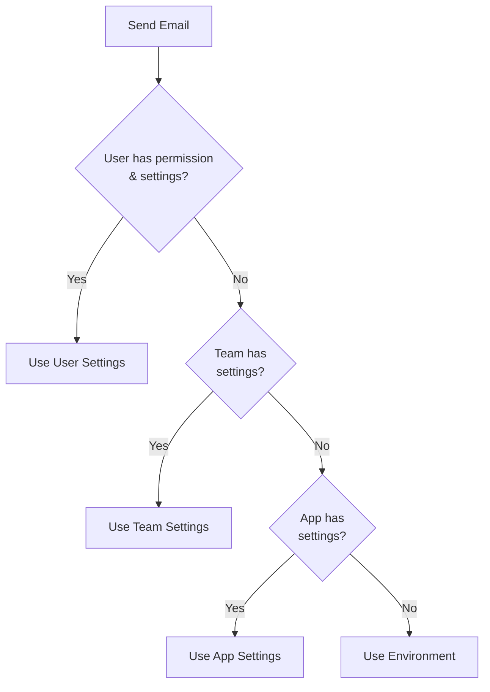

# Mail Builder System

The Mail Builder provides a fluent API for sending emails with **hierarchical credential resolution**. This allows emails to be sent using custom SMTP settings configured at the User, Team, or App level.

## Overview

```php
use App\Services\Mail\MailBuilder;

// Simple usage with default credentials
MailBuilder::make()
    ->to($user)
    ->subject('Welcome!')
    ->view('emails.welcome', ['user' => $user])
    ->send();

// Using a Mailable class
MailBuilder::make()
    ->to($user)
    ->mailable(new WelcomeMail($user))
    ->send();

// With explicit credential context
MailBuilder::make()
    ->to($user)
    ->mailable(new InvoiceMail($invoice))
    ->useCredentialsFrom($billingAdmin)
    ->useTeamCredentials($billingTeam)
    ->send();
```

## Credential Resolution Hierarchy

The MailBuilder resolves mail credentials in the following priority order:

1. **User Settings** - If the user has the `CONFIGURE_MAIL_SETTINGS` permission and has active mail settings
2. **Team Settings** - If the user's primary team has active mail settings
3. **App Settings** - If there are application-level mail settings configured
4. **Environment Variables** - Falls back to Laravel's default mail configuration from `.env`



## Template & Layout Architecture

The system uses a unified architecture for email content, with layouts and content templates stored in a single table distinguished by an `is_layout` boolean.

### Database Schema

-   **`email_templates`**: Unified table for both layouts and content.
    -   `is_layout`: Boolean distinguishing layouts (`true`) from content (`false`).
    -   `layout_id`: Self-referential FK (content templates reference their layout).
    -   `type`: Category (transactional, marketing, system).
    -   `status`: Draft, published, or archived.
    -   `is_system`: Protected system templates.
    -   `is_default`: Default layout flag.
    -   `entity_types`, `context_variables`: Merge tag configuration.
    -   `all_teams`, `teams()`: Team access restrictions.
    -   `preview`: Future image preview path.
    -   `translations`: Polymorphic relation to `email_translations`.
-   **`email_translations`**: Stores localized content (`subject`, `html_content`, `text_content`) for all templates.
-   **`email_template_team`**: Pivot table for team-based access control.

### Seeding & Unified Tag Resolution

Templates and Layouts are seeded from `resources/views/emails`. The seeder renders the Blade files to resolve translations and variables, storing the **rendered HTML** in the database.

> [!IMPORTANT]
> **Unified Merge Tag Format**: The entire system uses the `{{ tag }}` or `{{{ tag }}}` (for unescaped) format for merge tags.
> -   **In Database**: Content is stored as `{{ user.name }}`.
> -   **In Blade Files**: Use `@{{ user.name }}` if the tag is not provided in mock data, or just `{{ user.name }}` if it is.
> -   **Slot Replacement**: Layouts use `{{ $slot }}` or `{!! $slot !!}` which are replaced via string manipulation in `EmailLayoutComposer`.

### Layout Composition Logic

The `EmailLayoutComposer` service handles combining layouts with content. It uses a robust string-based replacement for the `$slot` placeholder to avoid unintended Blade execution of merge tags stored in the database.

```php
// Standard Slot Replacement (EmailLayoutComposer.php)
$parts = preg_split('/(\{\{\s*\$slot\s*\}\}|\{!!\s*\$slot\s*!!\})/', $layoutContent);
return implode($content, $parts);
```

## API Reference

### Recipient Methods

```php
// To a user (email extracted automatically)
->to($user)

// To an email address
->to('user@example.com')

// To multiple addresses
->to(['user1@example.com', 'user2@example.com'])
```

### Content Methods

```php
// From a Blade view
->view('emails.notification', ['data' => $data])

// Set subject (for view-based emails)
->subject('Your subject here')

// From a Mailable class
->mailable(new CustomMailable($data))
```

### Credential Methods

```php
// Use credentials from a specific user
->useCredentialsFrom($user)

// Use credentials from a specific team
->useTeamCredentials($team)

// Skip custom credentials (use environment defaults)
->useDefaultCredentials()
```

### Sending Methods

```php
// Send immediately
->send()

// Queue for later sending
->queue()

// Queue on a specific queue
->queue('high-priority')
```

### Debugging Methods

```php
// Get the resolved settings (null = using environment)
$settings = $builder->getResolvedSettings();

// Get the source name (user, team, app, environment)
$source = $builder->getSettingsSource();
```

## Mail Settings Model

Mail settings are stored in the `mail_settings` table and support polymorphic relationships:

```php
use App\Models\MailSettings;

// Get user's mail settings
$settings = MailSettings::getForUser($user);

// Get team's mail settings
$settings = MailSettings::getForTeam($team);

// Get app-level settings
$settings = MailSettings::getForApp();

// Check if settings have valid SMTP config
if ($settings->hasValidSmtpConfig()) {
    // Ready to send
}
```

### Creating Mail Settings

```php
// For a user
MailSettings::create([
    'settable_type' => User::class,
    'settable_id' => $user->id,
    'provider' => 'smtp',
    'host' => 'smtp.example.com',
    'port' => 587,
    'username' => 'user@example.com',
    'password' => 'encrypted-automatically',
    'encryption' => 'tls',
    'from_address' => 'noreply@example.com',
    'from_name' => 'My App',
    'is_active' => true,
]);

// For a team
MailSettings::create([
    'settable_type' => Team::class,
    'settable_id' => $team->id,
    // ... same fields
]);

// For the app
MailSettings::create([
    'settable_type' => 'app',
    'settable_id' => null,
    // ... same fields
]);
```

> [!NOTE]
> The `password` field is automatically encrypted using Laravel's `encrypted` cast.

## Permission System

Users must have the `CONFIGURE_MAIL_SETTINGS` permission to use their personal mail settings:

```php
use App\Constants\Auth\Permissions;

// Give permission
$user->givePermissionTo(Permissions::CONFIGURE_MAIL_SETTINGS);

// Check permission
if ($user->can(Permissions::CONFIGURE_MAIL_SETTINGS)) {
    // User can configure and use custom mail settings
}
```

## Mailable Classes

Two default mailables are provided:

### UserActivationMail

Used when creating new users with activation emails:

```php
use App\Mail\UserActivationMail;

$mail = new UserActivationMail($user, $activationUrl);
// Includes: user name, activation link, expiration notice
```

### WelcomeMail

Sent after successful account activation:

```php
use App\Mail\WelcomeMail;

$mail = new WelcomeMail($user);
// Includes: welcome message, login link
```

## MailCredentialResolver

For advanced use cases, you can use the resolver directly:

```php
use App\Services\Mail\MailCredentialResolver;

$resolver = new MailCredentialResolver();

// Resolve settings for a context
$settings = $resolver->resolve($user, $team);

// Get the source
$source = $resolver->getSettingsSource($user, $team);
// Returns: 'user', 'team', 'app', or 'environment'

// Check if custom settings exist
$hasCustom = $resolver->hasCustomSettings($user, $team);
```

## Best Practices

1. **Use Mailables** - For complex emails, create dedicated Mailable classes
2. **Queue Emails** - Use `->queue()` for production to avoid blocking requests
3. **Test Settings** - Use `hasValidSmtpConfig()` before sending important emails
4. **Monitor Sources** - Log `getSettingsSource()` for debugging delivery issues

---

## Mailpit Integration (Development)

Mailpit is a local email testing tool that intercepts all outgoing emails and provides a web UI to view them.

### Configuration

Set `MAIL_MAILER=mailpit` in `.env` to use Mailpit:

```env
# Use Mailpit for local development
MAIL_MAILER=mailpit
MAILPIT_HOST=127.0.0.1
MAILPIT_PORT=1025
```

### Starting Mailpit

```bash
# Install via Homebrew (macOS)
brew install mailpit

# Run Mailpit
mailpit
```

Mailpit UI is available at http://localhost:8025

### MailpitClient API

The `MailpitClient` service provides programmatic access to Mailpit for testing:

```php
use App\Services\Mail\MailpitClient;

$client = new MailpitClient();

// Check if Mailpit is running
if ($client->isAvailable()) {
    // Get all messages
    $messages = $client->getMessages();
    
    // Get messages for a specific email
    $messages = $client->getMessagesTo('user@example.com');
    
    // Wait for a message to arrive
    $message = $client->waitForMessage('user@example.com', timeoutSeconds: 10);
    
    // Extract links from email
    $links = $client->extractLinksFromMessage($messageId);
    
    // Clear all messages
    $client->deleteAllMessages();
}
```

---

## Development Email Protection

The system includes protection to prevent sending emails to real users during development.

### Configuration

```env
# Enable redirect protection
MAIL_DEV_REDIRECT_ENABLED=true

# Redirect all emails to these addresses (comma-separated)
MAIL_DEV_REDIRECT_TO=dev@example.com,admin@example.com

# Allow emails to users with these roles to pass through (comma-separated)
MAIL_DEV_REDIRECT_TO_ROLES=superAdmin
```

### How It Works

When `MAIL_DEV_REDIRECT_ENABLED=true`:

1. All outgoing emails are intercepted by `DevEmailRedirectListener`
2. Original recipients are stored in `X-Original-To` header for debugging
3. Recipients are replaced with addresses from `MAIL_DEV_REDIRECT_TO`
4. Users with roles in `MAIL_DEV_REDIRECT_TO_ROLES` receive emails normally

> [!IMPORTANT]
> Always set `MAIL_DEV_REDIRECT_ENABLED=false` in production!

### Switching to Production

```env
# Production settings
APP_ENV=production
MAIL_MAILER=smtp
MAIL_HOST=smtp.sendgrid.net
MAIL_DEV_REDIRECT_ENABLED=false
```

---

## Testing Email Features

### Unit Tests with Mail::fake

```php
Mail::fake();

// Trigger email...
$userService->createUser(['email' => 'test@example.com'], sendActivation: true);

// Assert email was queued (for ShouldQueue mailables)
Mail::assertQueued(UserActivationMail::class, function ($mail) {
    return $mail->hasTo('test@example.com');
});
```

### Integration Tests with Mailpit

```php
$mailpit = new MailpitClient();

if ($mailpit->isAvailable()) {
    $mailpit->deleteAllMessages();
    
    // Trigger email...
    
    $message = $mailpit->waitForMessage('test@example.com', 5);
    expect($message)->not()->toBeNull();
}
```

## Related Documentation

- [Notification Builder System](./notification-builder-system.md)
- [User Management](./user-management.md)

## 5. Draft & Publish Workflow (Content & Layouts)
To prevent unfinished changes from affecting live emails, the system uses a **Draft/Publish** workflow for both **Email Contents** and **Layouts**.

### Database Schema
The `email_translations` table includes draft-specific columns:
*   `draft_subject`
*   `draft_html_content`
*   `draft_text_content`
*   `draft_preheader`

### Workflow Logic
1.  **Drafting**: When editing in the Builder (for Content or Layouts), changes are saved to the `draft_*` columns.
2.  **Publishing**:
    *   Triggered via `EmailTemplateService::publish()`.
    *   Dispatches `EmailTemplatePublished` event.
    *   **Listener (`PublishEmailTemplateContent`)**: Copies `draft_*` values to the main columns (`subject`, `html_content`, etc.) and sets `status` to `PUBLISHED` (if applicable).
3.  **Restoring**:
    *   Triggered via `EmailTemplateService::restoreToDraft()`.
    *   Copies published values back to `draft_*` columns, discarding unsaved changes.
    *   **Constraint**: The "Restore" action is only available if the template status is `DRAFT`. This ensures published templates must be explicitly moved to draft (or edited as draft) before restoration logic applies.

### Layout Specifics
*   **Placeholder Injection**: When **previewing a Draft Layout**, the system automatically injects a visual "Content Placeholder" block into the `{{ $slot }}` area.
*   **Draft Visualization**: Layouts can be previewed in Draft mode to see changes before they go live across all linked templates.

### Automated Text Generation
*   **Event**: `EmailTemplateSaved`
*   **Listener**: `GenerateTextVersion`
*   **Behavior**: Automatically converts `draft_html_content` to `draft_text_content` (and `html_content` to `text_content`) whenever the template is saved.

### Service Layer
*   **`EmailTemplateService`**: The central entry point for these actions.
    *   `saveDraft(EmailTemplate $template, array $translations)`
    *   `publish(EmailTemplate $template)`
    *   `restoreToDraft(EmailTemplate $template)`

