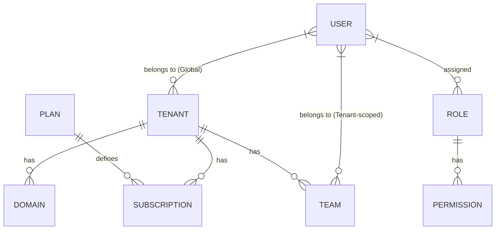

# Tenant and Plan Architecture

This document describes the relationship between Tenants, Plans, and Subscriptions within the application.

## Overview

The application uses a centralized multi-tenant architecture where identity (Users), permissions (RBAC), and subscription data (Plans, Subscriptions) are stored in a **central database**, while application-specific data is stored in **tenant-specific databases**.

## Database Connections

- **Central Database**: `central` connection. Stores:
    - `tenants`
    - `domains`
    - `users`
    - `tenant_user` (Pivot linking users to tenants)
    - `roles`, `permissions` (RBAC)
    - `plans`
    - `subscriptions`
- **Tenant Database**: `tenant` connection. Stores:
    - `teams`, `projects`, etc.
    - `team_user` (Pivot linking users to teams within a tenant)
    - Tenant-specific application data.

## Models Relationship

### 1. Plan Model (`App\Models\Plan`)
Defines the subscription tiers available in the system.
- **Attributes**: `name`, `tier` (Enum), `price`, `currency`, `billing_cycle`, `features` (JSON), `is_active`.
- **Connection**: `central`.
- **Logic**: Plans are created and managed by System Administrators.

### 2. Tenant Model (`App\Models\Tenant`)
Represents a customer organization or workspace.
- **Attributes**: `id` (slug), `name`, `data` (JSON).
- **Connection**: `central`.
- **Tenancy**: Uses `stancl/tenancy` for database isolation. Each tenant has its own database.

### 3. Subscription Model (`App\Models\Subscription`)
Links a Tenant to a Plan for a specific period.
- **Attributes**: `tenant_id`, `plan_id`, `starts_at`, `ends_at`, `is_active`.
- **Connection**: `central`.
- **Logic**: When a tenant subscribes to a new plan, previous active subscriptions are automatically deactivated.

### 4. User-Tenant Relationships
There are two levels of association:
1. **Global Association** (`tenant_user` table in `central` DB): Links a user to a tenant globally.
2. **Team Association** (`team_user` table in `tenant` DB): Links a user to specific teams *within* a tenant.

- **Permissions**: RBAC is global (stored centrally) but can be applied to tenant-scoped operations.

## Workflows

### Tenant Creation
1. Admin creates a `Tenant` record in the central database.
2. `stancl/tenancy` automatically creates a new database for the tenant.
3. Migrations in `database/migrations/tenant/` are run against the new database.
4. (Optional) Default data is seeded into the tenant database (e.g., initial Team creation).

### Subscription Lifecycle
1. Admin or User selects a `Plan`.
2. A new `Subscription` record is created linking the `Tenant` and `Plan`.
3. The application checks the current subscription status when authorizing tenant-specific features (e.g., via Middleware or Policies).

## Common Pitfalls & Solutions

### Connection Leakage
**Problem**: Eloquent models sometimes try to use the tenant connection for central models (like Plans) when inside a tenant context.
**Solution**: Central models MUST explicitly define `protected $connection = 'central';` and extend a base model that handles this consistently.

### Mass Assignment in Tests
**Problem**: Creating models in tests might fail if attributes like `is_super_admin` are not in `$fillable`.
**Solution**: Use factories or set attributes manually on the model instance before saving.

### Pivot Table Connections
**Problem**: Pivot tables like `tenant_user` (central) or `team_user` (tenant) must use the correct connection.
**Solution**: 
- `TenantUser` pivot (Global) uses `central`.
- `TeamUser` pivot (Tenant-scoped) uses the active tenant connection (no `$connection` property).
Using relationship methods like `attach()` on a model usually inherits the correct connection from that model.
